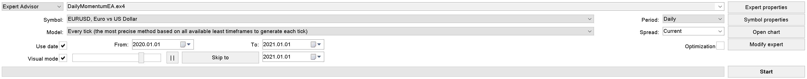
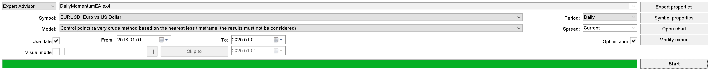
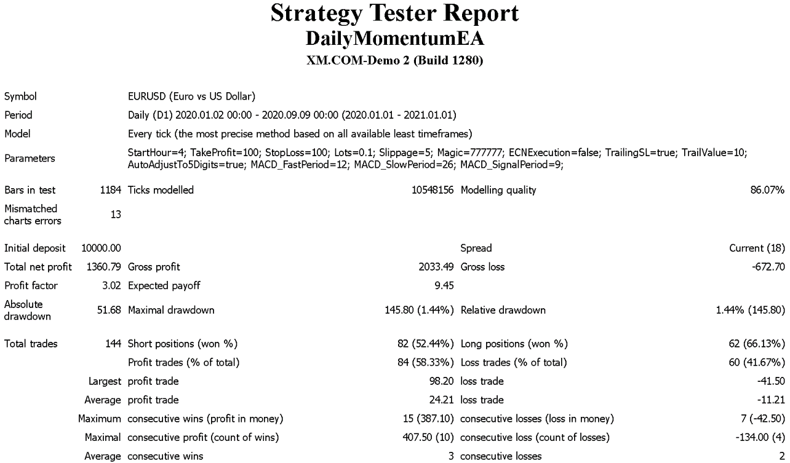

# Momentum-Trading

Momentum trading strategy using MACD (12, 26, 9)

    
## Initial results (before optimization)

Testing period: January 2020 - September 2020 (8 months)

Expert advisor's default settings:

    StartHour         = 0
    TakeProfit        = 100
    StopLoss          = 100
    Lots              = 0.1
    Slippage          = 5
    TrailingStopLoss  = true
    TrailValue        = 100
    MACD_FastPeriod   = 12
    MACD_SlowPeriod   = 26
    MACD_SignalPeriod = 9
    

## Backtesting

Backtesting period: January 2018 - January 2020 (24 months)

## Forward testing

Testing period (with optimized settings): January 2020 - September 2020 (8 months)

Expert advisor's optimized settings:

    StartHour         = 4
    TakeProfit        = 100
    StopLoss          = 100
    Lots              = 0.1
    Slippage          = 5
    TrailingStopLoss  = true
    TrailValue        = 10
    MACD_FastPeriod   = 12
    MACD_SlowPeriod   = 26
    MACD_SignalPeriod = 9

## Live trading on virtual private server
