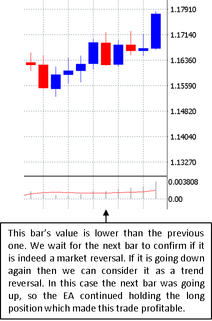

# Momentum-Trading

The MACD is a trend-following momentum indicator that shows the relationship between two moving averages of a security's price and is constructed as follows:

> MACD line: 12-period EMA - 26-period EMA

> Signal line: 9-period EMA of MACD line

> MACD histogram: MACD line - Signal line

The objective of this MT4 expert advisor is to take advantage of the market's momentum reflected in the MACD histogram.

As we can see in the chart above, a local extremum in the MACD histogram, whether positive or negative, translates into a market reversal.

In brief, this EA looks for these extrema by comparing the last MACD value to the past ones.

Let Yn be the last MACD value, Yn-1 the previous one, and Yn-2 the one before that, our conditions will be as follows:

> Bullish signal if Yn > Yn-1 & Yn-1 > Yn-2

> Bearish signal if Yn < Yn-1 & Yn-1 < Yn-2

In both case, the second comparison is for confirmation. As a matter of fact, we do not want to change our position based on a single comparison. The example below is an illustration of why:

## Initial results (before optimization)

Testing period: January 2020 - September 2020 (8 months)

Expert advisor's default settings:

    StartHour         = 0
    TakeProfit        = 100
    StopLoss          = 100
    Lots              = 0.1
    Slippage          = 5
    TrailingStopLoss  = true
    TrailValue        = 100
    MACD_FastPeriod   = 12
    MACD_SlowPeriod   = 26
    MACD_SignalPeriod = 9
    

## Backtesting

Backtesting period: January 2018 - January 2020 (24 months)

## Forward testing

Testing period (with optimized settings): January 2020 - September 2020 (8 months)

Expert advisor's optimized settings:

    StartHour         = 4
    TakeProfit        = 100
    StopLoss          = 100
    Lots              = 0.1
    Slippage          = 5
    TrailingStopLoss  = true
    TrailValue        = 10
    MACD_FastPeriod   = 12
    MACD_SlowPeriod   = 26
    MACD_SignalPeriod = 9

## Live trading on virtual private server

Google Cloud virtual machine instance for live trading 24/7
