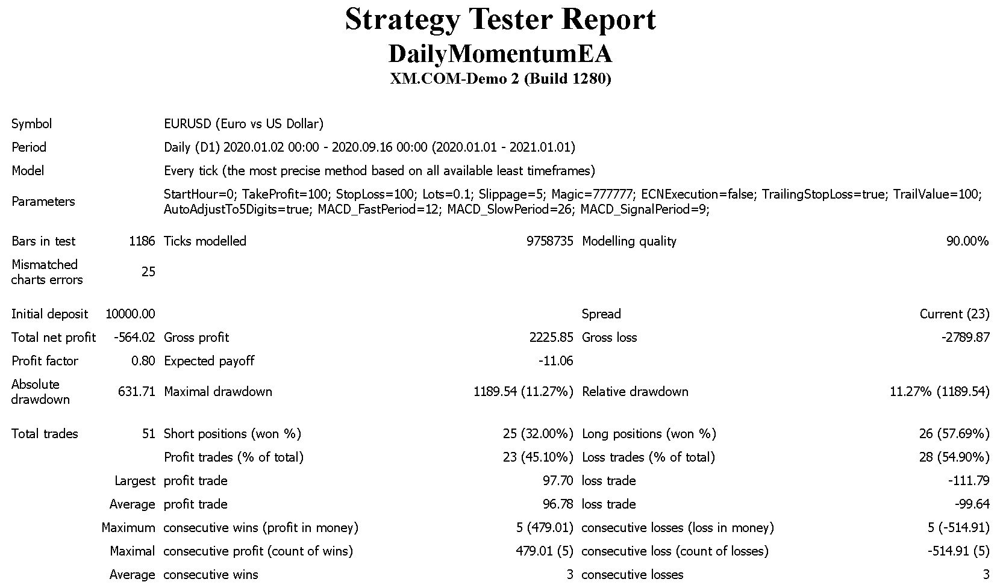

# Momentum-Trading

Momentum trading strategy using MACD (12, 26, 9)

## Parameters

Expert advisor's default settings:

    StartHour         = 0
    TakeProfit        = 100
    StopLoss          = 100
    Lots              = 0.1
    Slippage          = 5
    TrailingStopLoss  = true
    TrailValue        = 100
    MACD_FastPeriod   = 12
    MACD_SlowPeriod   = 26
    MACD_SignalPeriod = 9
    

    
## Initial results

## Backtesting

## Forward testing

## Live trading on VPS
